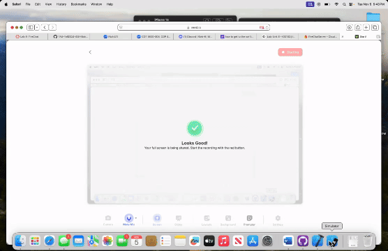

# Lab 6 - *FireChat*

Submitted by: **Noah Russell** **Z23667779**

**FireChat** is a SwiftUI-powered chat application that leverages Firebase Firestore as its backend server for real-time communication. The app allows users to send and receive text messages in a dynamic chat environment. Through Firebase’s real-time listeners and Firestore’s seamless syncing, users can interact with each other instantly across devices. With the power of Firebase, this app offers an efficient, scalable solution for real-time messaging—without the need to manage a custom backend.

Time spent: **4** hours spent in total

## Required Features

The following **required** functionality is completed:

- [✅] Create and send a text message to Firebase
- [✅] Receive messages posted to Firebase in real-time
- [✅] Display messages differently based on the sender (position and color change depending on whether the user sent the message or someone else did)

 
The following **optional** features are implemented:

- [❌] TBD

The following **additional** features are implemented:

- [ ] List anything else that you can get done to improve the app functionality!

## Video Walkthrough

My video Walkthrough:

GIF created with VEED.io

## Notes

This app was built using Firebase Firestore for backend storage and real-time synchronization. The chat UI is powered by SwiftUI, with messages updating dynamically as they are posted by other users. The use of Firestore listeners allows the app to automatically update the chat interface without the need to manually refresh or reload the data.

The user interface is designed to distinguish between messages sent by the current user and others, with different colors and positioning to improve readability and enhance the user experience.

I look forward to continuing to build on this app and adding more features such as media sharing and user authentication in future updates.

## License

    Copyright [2024] [Noah Russell]

    Licensed under the Apache License, Version 2.0 (the "License");
    you may not use this file except in compliance with the License.
    You may obtain a copy of the License at

        http://www.apache.org/licenses/LICENSE-2.0

    Unless required by applicable law or agreed to in writing, software
    distributed under the License is distributed on an "AS IS" BASIS,
    WITHOUT WARRANTIES OR CONDITIONS OF ANY KIND, either express or implied.
    See the License for the specific language governing permissions and
    limitations under the License.
